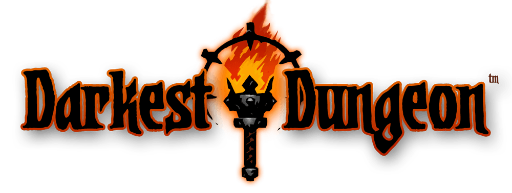
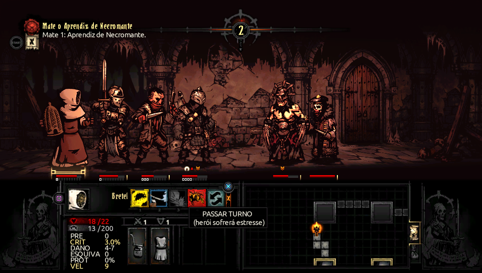
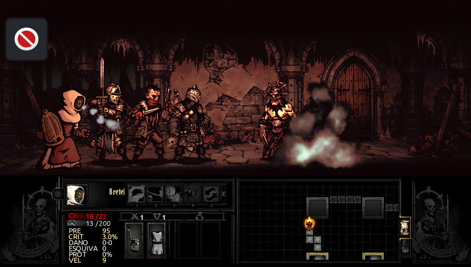
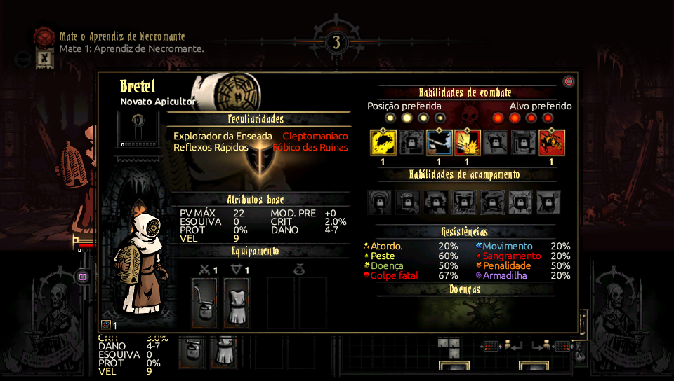
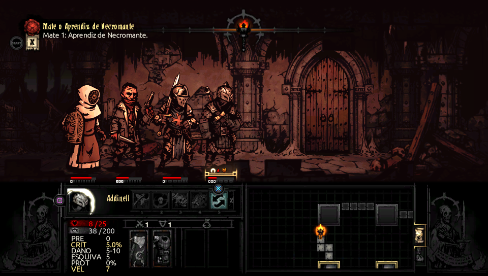

<div align="center">
  
  <h1>The Beekeeper Class - PS Vita Edition</h1>
  
    <p>A custom class mod adapted for <strong>Darkest Dungeon on PlayStation Vita</strong>.</p>
</div>

<br>
<br>

This project provides a Windows patcher that converts the original PC class mod to Vita-compatible assets and merges it into the user's own `content_patch_13.psarc` for use with **rePatch**.

> [!WARNING]
> No Darkest Dungeon game files, Beekeeper mod files, or PlayStation Vita SDK tools are distributed by this repository.
>
> You must provide legally obtained copies yourself.

<br>

## Project Status
<table align="center">
  <thead>
    <tr>
      <th align="center">Component</th>
      <th align="center">Status</th>
    </tr>
  </thead>
  <tbody>
    <tr>
      <td align="center">Beekeeper class / Stage Coach</td>
      <td align="center">✅ Working</td>
    </tr>
    <tr>
      <td align="center">Combat data and animations</td>
      <td align="center">✅ Working</td>
    </tr>
    <tr>
      <td align="center">Vita GXT textures</td>
      <td align="center">✅ Working</td>
    </tr>
    <tr>
      <td align="center">Vita localization</td>
      <td align="center">✅ Working</td>
    </tr>
    <tr>
      <td align="center">Multilanguage support</td>
      <td align="center">✅ Working</td>
    </tr>
    <tr>
      <td align="center">PSARC rebuild / rePatch output</td>
      <td align="center">✅ Working</td>
    </tr>
    <tr>
      <td align="center">Beekeeper-specific custom audio</td>
      <td align="center">❌ Not supported yet</td>
    </tr>
  </tbody>
</table>

> [!NOTE]
> **The class is currently silent for its own custom SFX on PS Vita.** The original PC `hero_beekeeper.bank` uses an FMOD/FSB5 audio format that is not compatible with the Vita build. Loading that bank caused `C2-12828-1` crashes during game loading, so v1.0.0 intentionally excludes the PC audio payload. Base-game audio is unaffected.

Validated on real PS Vita hardware with:

```text
Darkest Dungeon 1.17
Title ID: PCSE00919
```

## Screenshots on PS VIta

<p align="center">
  
  
</p>
<p align="center">
  
  
</p>

## Patcher

The Windows build does not require Python. It does require your own copies of the Vita SDK utilities `psp2gxt.exe` and `psp2psarc.exe`.

<p align="center">

</p>

Place them beside the patcher like this:

```text
DDBeekeeperClassVita.exe
tools/
├── psp2gxt.exe
└── psp2psarc.exe
```

Then:

1. Select your original Vita `content_patch_13.psarc`.
2. Select the original Beekeeper PC mod ZIP or folder.
3. Choose an output directory.
4. Leave **Force Beekeeper in Stage Coach** disabled unless you are debugging.
5. Click **Build rePatch**.
6. Copy the generated `rePatch` folder to the root of `ux0:`.

Expected output:

```text
rePatch/
└── PCSE00919/
    └── content_patch_13.psarc
```

The patcher deliberately ignores the PC mod's `audio` directory. Do not manually copy `hero_beekeeper.bank` or a modified `audio/load_order.json` into the Vita rePatch folder.

## How it works

Darkest Dungeon Vita cannot load the PC mod directly. The patcher adapts the class to the formats and layout expected by the Vita version:

```text
Original Vita content_patch_13.psarc
                +
Original Beekeeper PC mod
                ↓
Extract Vita archive
                ↓
Merge Beekeeper into the content root
                ↓
PNG → Vita GXT textures
.loc2/XML → Vita legacy localization
Remove PC-only audio and extraction helpers
                ↓
Rebuild + verify PSARC
                ↓
rePatch/PCSE00919/
```

Texture conversion follows the layout and GXT conventions used by official Vita content. The class assets are converted to swizzled GXT using BC1 or BC3 depending on alpha requirements.

The PC mod's modern `.loc2` localization files are converted to the older `.loc` format expected by the Vita release.

## Why audio is disabled

The original Beekeeper PC bank contains an FSB5 sample bank encoded as **Vorbis**, while native Darkest Dungeon Vita hero banks use **FADPCM**. Directly loading the PC bank on Vita caused reproducible loading crashes.

Several bridge and bank-replacement experiments were tested on real hardware. The stable configuration is the one used by v1.0.0: the class content is installed normally, but the custom PC FMOD payload is excluded entirely.

Audio can be revisited later if a genuinely Vita-compatible Beekeeper FMOD bank is produced. Until then, the patcher prioritizes a stable, playable class over unsafe audio injection.

## Building from source

Requirements:

- Windows 10/11;
- Python 3.13+;
- packages from `requirements.txt`;
- authorized copies of `psp2gxt.exe` and `psp2psarc.exe` placed in `tools/`.

Run the source GUI with:

```text
DDBeekeeperClassVita.bat
```

Build the standalone executable with:

```text
Build_EXE.bat
```

Sony SDK binaries are intentionally excluded from the repository and from GitHub Releases.

## Credits

- **The Beekeeper Class:** [Nick Noir](https://nick-noir.itch.io/darkest-dungeon-beekeeper)
- **Darkest Dungeon:** Red Hook Studios

This is an unofficial fan project and is not affiliated with or endorsed by Red Hook Studios, Sony Interactive Entertainment, or Nick Noir.

## AI NOTICE

GPT-5.6 Sol through Codex was used as a development assistant for diagnostics, implementation support, project organization and technical documentation. 
