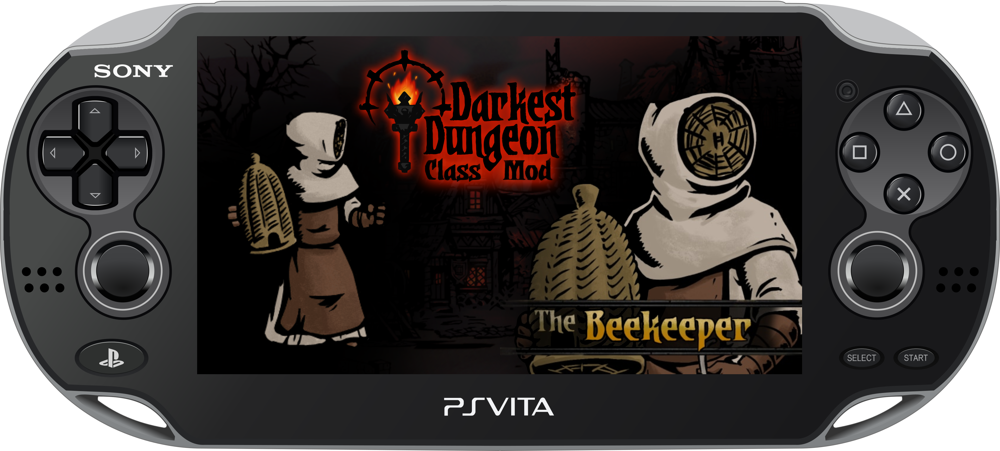

<p align="center">
  
</p>

<p align="center">
  <picture>
    <source
      media="(prefers-color-scheme: dark)"
      srcset="https://github.com/user-attachments/assets/2b1ae139-5a27-4e3a-b3f8-eb813f5f2b94"
    >
    <source
      media="(prefers-color-scheme: light)"
      srcset="https://github.com/user-attachments/assets/b3bf4273-0aa1-4411-80ea-7f4ad1bf12bd"
    >
    
  </picture>
</p>

PS Vita mod port of **The Beekeeper Class** by [Nick Noir](https://nick-noir.itch.io/darkest-dungeon-beekeeper) for **Darkest Dungeon 1.17**.

This project provides a Windows patcher that converts the original PC class mod to Vita-compatible assets and merges it into the user's own `content_patch_13.psarc` for use with **rePatch**.

> [!NOTE]
> No Darkest Dungeon game files, Beekeeper assets, or Sony SDK binaries are distributed by this repository.
> You must provide legally obtained copies of the required files.

## Project Status

| Gameplay | Vita Integration |
| --- | --- |
| ✅ Beekeeper class / Stage Coach | ✅ Vita GXT textures |
| ✅ Combat data and animations | ✅ Vita localization |
| ✅ Multilanguage support | ✅ PSARC rebuild / rePatch output |
| ⚠️ Custom Beekeeper audio | |

### Tested on

```text
Darkest Dungeon v1.17
Title ID: PCSE00919
Region: US
```

## How it works

The PS Vita release cannot use the original PC mod directly.

The patcher adapts the class to the formats and content layout expected by the Vita version:

```text
Original Vita content_patch_13.psarc
                +
Original Beekeeper PC mod
                ↓
Extract Vita archive
                ↓
Merge Beekeeper into the content root
                ↓
PNG → Vita GXT textures
.loc2 → Vita legacy .loc localization
Manifest regeneration
                ↓
Rebuild + verify PSARC
                ↓
rePatch/PCSE00919/
```

### Textures

Vita textures use **GXT** data even when Darkest Dungeon keeps the original `.png` filenames.

The conversion pipeline was derived by comparing the original Beekeeper assets against official Vita content, particularly the **Shieldbreaker DLC**.

The patcher:

- resizes textures to Vita-appropriate power-of-two dimensions;
- converts them to DDS;
- uses BC1/DXT1 or BC3/DXT5 depending on the asset;
- converts the DDS data to swizzled GXT;
- validates the resulting GXT dimensions and format;
- preserves the original design dimensions in the associated metadata.

### Localization

The PC mod uses modern `.loc2` localization files while the Vita release expects the older `.loc` format.

The patcher converts the Beekeeper localization to the Vita-compatible format and can apply additional translations through `translations.json`.

### PSARC

The original `content_patch_13.psarc` is:

1. verified;
2. extracted;
3. patched;
4. given an updated manifest;
5. rebuilt;
6. verified again.

The resulting archive is placed directly into a rePatch-ready structure.

## Patcher


The Windows build does **not** require Python.

1. Download `DDBeekeeperClassVita.exe`.
2. Select your original Vita `content_patch_13.psarc`.
3. Select the original Beekeeper mod ZIP or folder.
4. Choose an output directory.
5. Click **Build rePatch**.
6. Copy the generated `rePatch` folder to the root of `ux0:`.

Expected output:

```text
rePatch/
└── PCSE00919/
    ├── content_patch_13.psarc
    └── audio/
        └── ...
```

The patcher also includes an optional **Force Beekeeper in Stage Coach** setting.

This replaces the Stage Coach class pool with Beekeeper and is intended only for debugging and validation.

**It is disabled by default.**

## Why this mod port was not straightforward

Darkest Dungeon PC mods cannot be used directly on PS Vita.

The Vita release uses different content layouts, GXT textures, legacy localization, PSARC packaging and platform-specific FMOD audio. Public Vita modding information is also limited, with most existing work focused on simpler data edits rather than complete custom class ports.

This project therefore required deriving the missing conversion rules from official Vita assets, especially the Shieldbreaker DLC, and validating them on real hardware.

## Development history

### Class discovery

The first attempts treated Beekeeper as an additional DLC:

```text
dlc/beekeeper_class/
```

The modified PSARC loaded and the Stage Coach data could be changed, but the custom class itself was not discovered correctly.

The approach was changed so that Beekeeper content is merged directly into the archive root:

```text
heroes/
effects/
raid/
shared/
upgrades/
...
```

This allowed the Vita build to discover and instantiate the custom hero.

### Texture conversion

The next major issue was asset compatibility.

Darkest Dungeon Vita keeps `.png` filenames for many textures, but the contents are actually Vita **GXT** texture data.

Comparing Beekeeper assets with the official Vita Shieldbreaker files allowed a compatible conversion pipeline to be derived.

The Beekeeper texture set is now automatically resized, compressed and converted during the patch process.

### Localization

The original Beekeeper localization also could not be copied directly.

A `.loc2` → legacy `.loc` conversion pipeline was implemented and later expanded with `translations.json` to support additional languages.

### Audio

Custom Beekeeper audio remains experimental.

The current patcher can:

- copy `hero_beekeeper.bank` into the Vita audio hierarchy;
- add the bank to the game's `audio/load_order.json`.

It does **not currently rebuild the original PC FMOD bank**.

This distinction is important because FMOD uses platform-specific sample encoding and playback strategies.

For PS Vita, FMOD recommends **FADPCM for compressed sound effects**, while the hardware-assisted **AT9** codec is primarily suited to streamed audio such as music.

A proper Beekeeper audio conversion therefore likely requires rebuilding the sample data using Vita-compatible encoding while preserving the original FMOD events, references and GUID relationships.

This is still under investigation and is not considered fully validated.

## Building from source

Requirements:

- Windows 10/11;
- Python 3.13+;
- dependencies from `requirements.txt`;
- authorized copies of `psp2gxt.exe` and `psp2psarc.exe`.

Place the SDK tools in:

```text
tools/
├── psp2gxt.exe
└── psp2psarc.exe
```

Then run:

```text
Build_EXE.bat
```

The executable is built with PyInstaller as:

```text
dist/
└── DDBeekeeperClassVita.exe
```

Sony SDK binaries are intentionally excluded from this repository and must not be redistributed.

## Credits

- **The Beekeeper Class:** [Nick Noir](https://nick-noir.itch.io/darkest-dungeon-beekeeper)
- **Darkest Dungeon:** [Red Hook Studios ](https://www.darkestdungeon.com/)
- **DDManager** by **briartone**

_This is an unofficial fan project and is not affiliated with or endorsed by Red Hook Studios, Sony Interactive Entertainment, or Nick Noir._

---

## IA Notice (ChatGPT 5.6 Sol)

AI assistance was used during technical research, reverse-engineering analysis, code review and documentation of this project.
Implementation decisions and PS Vita hardware validation were performed and reviewed manually.
